# Hadoop源码环境搭建及编译


## 一、课前准备

1.  下载hadoop2.7.0源代码

## 二、课堂主题

1. 围绕Hadoop源码环境搭建及编译讲解


## 三、课堂目标

1.  搭建Hadoop源码阅读环境
2.  学会如何编译Hadoop源码

## 四、知识要点

### 1. 搭建windows下Hadoop源码阅读环境

> 以windows下为例（linux下的类似）

#### 1.1 下载对应版本的Hadoop源码包

1. 此处以Hadoop-2.7.0为例

2. 进入Hadoop官网 https://hadoop.apache.org/  按图操作

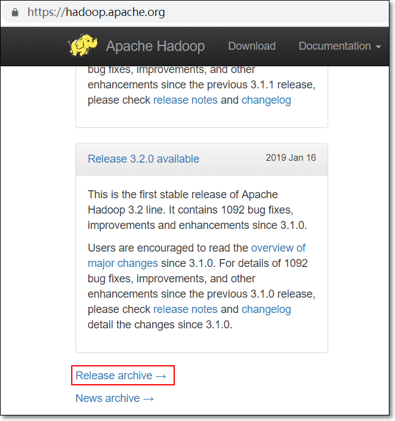

3. 

.png)

4. 下载Hadoop 2.7.0源代码

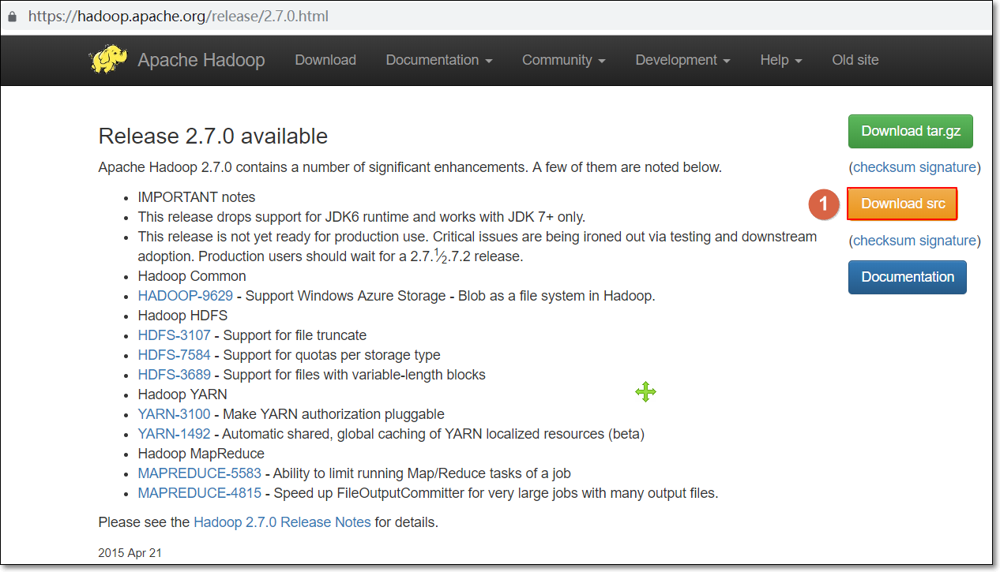

#### 1.2 源码导入IDEA

1. 将源代码解压到本地路径
2. 将源代码导入IDEA中；打开IDEA，并导入源码


3. 选择本地解压后的hadoop源码包；依次按图中步骤操作

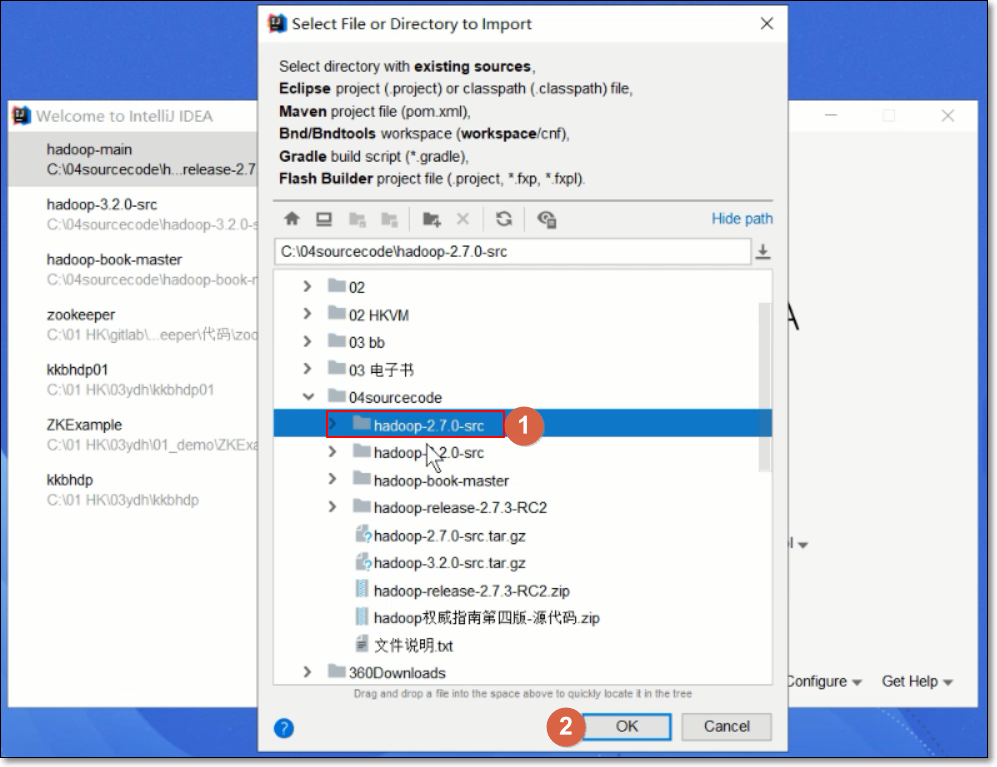


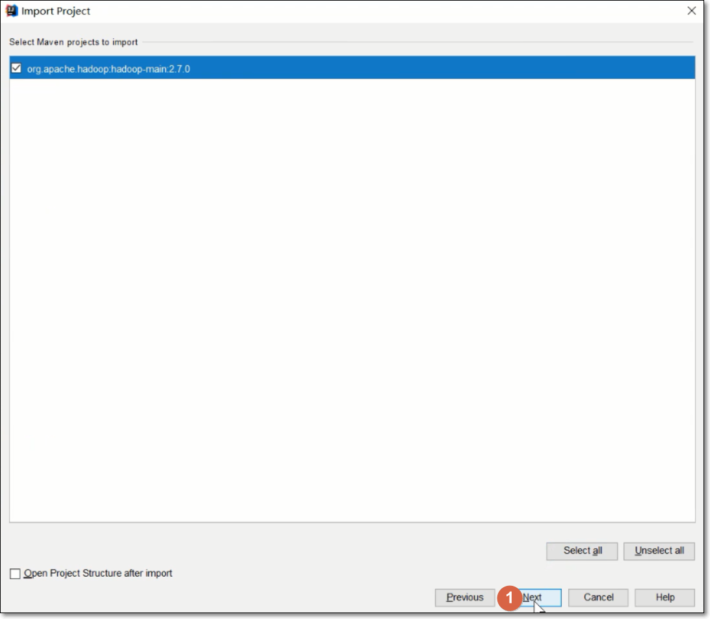

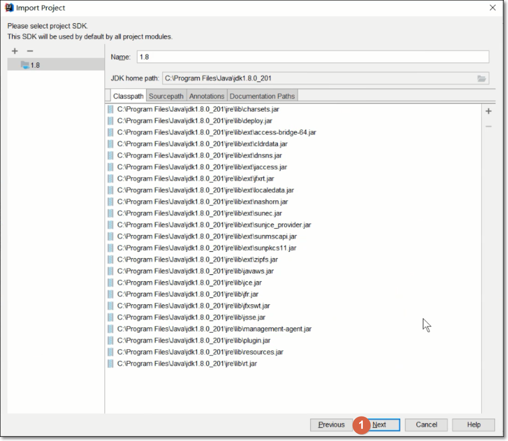

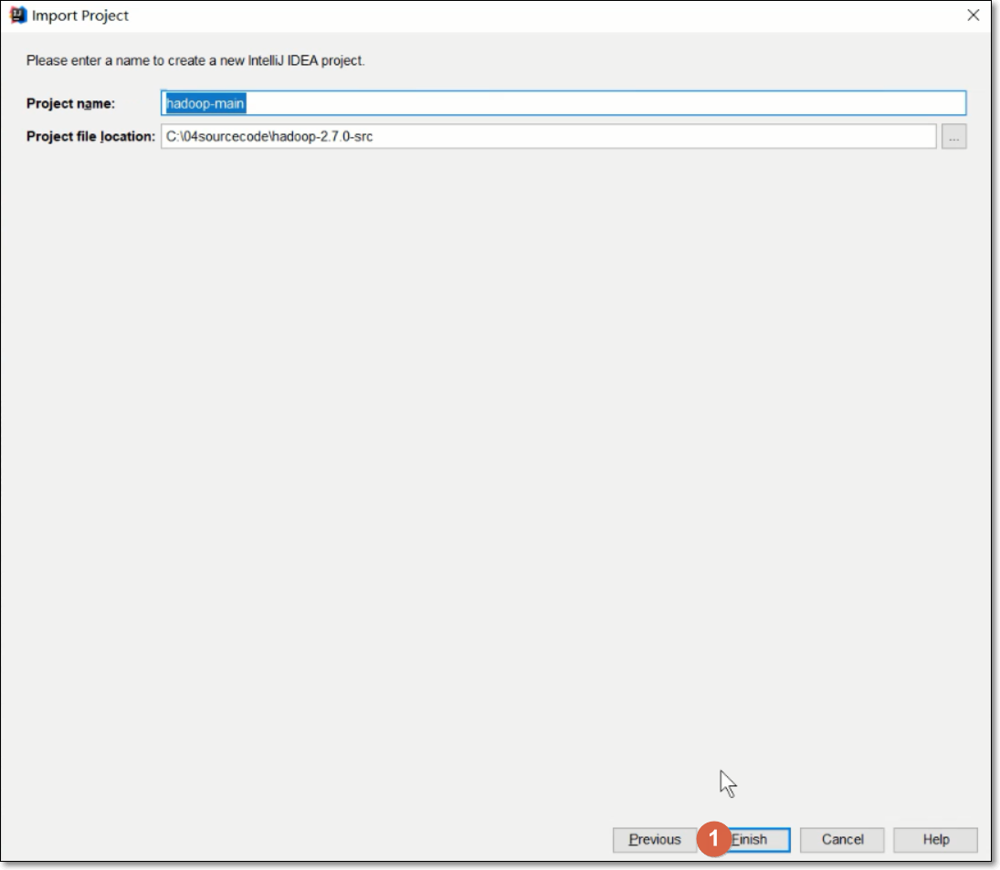

4. 正在resolving dependencies 解决依赖

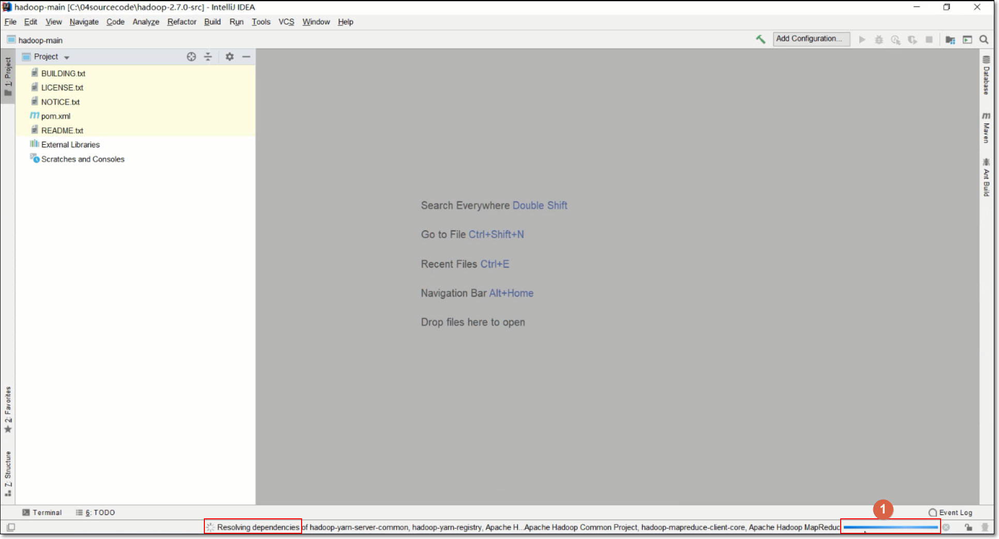

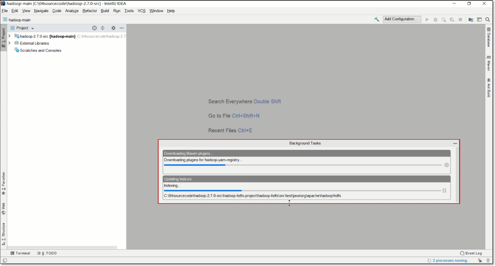

5. 源码导入成功

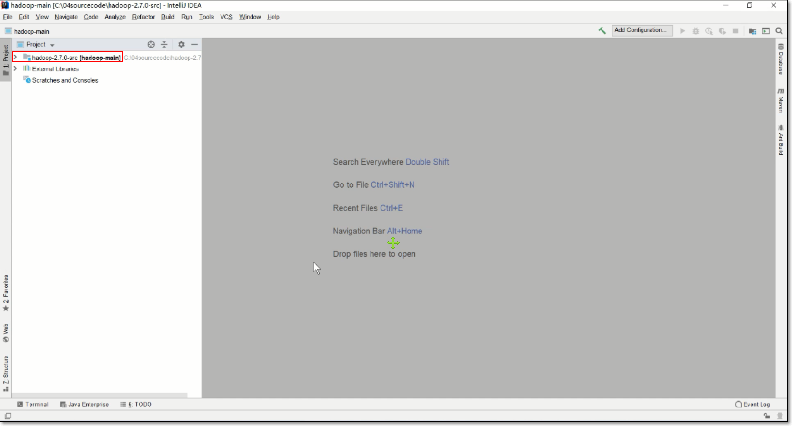

### 2. 编译Hadoop源码

编译源码最好是在linux平台，此处用CentOS7.4平台编译源码

#### 2.1 查看编译说明文件

将hadoop-2.7.0-src.tar.gz源码包放到/opt目录下

将源码包解压到/opt目录

```shell
[root@node-01 opt]# cd /opt/
[root@node-01 opt]# tar -xzvf hadoop-2.7.0-src.tar.gz
```

进入解压出来的目录

```shell
[root@node-01 opt]# cd hadoop-2.7.0-src/
[root@node-01 opt]# ls
```

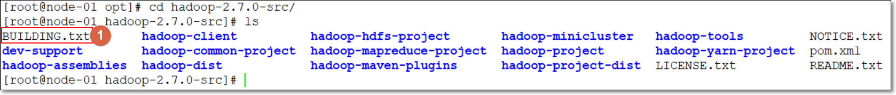

BUILDING.txt文件是编译hadoop源码的说明文件；打开文件，列出了编译hadoop源码时，要求软件及对应版本要求

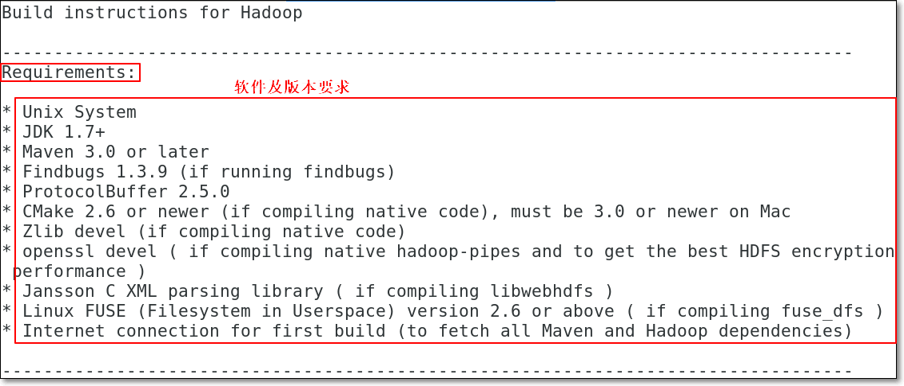

要求在Unix系统下编译

#### 2.2 安装JDK

要求版本：JDK1.7+

确定JDK是否已经安装，要求JDK1.7或以上版本

**若已经安装非系统自带的openjdk且是版本符合要求，则略过步骤“安装JDK”**；出现下边结果，说明已经安装符合要求的JDK

```shell
[root@node-01 jdk1.8.0_201]# java -version
java version "1.8.0_201"
Java(TM) SE Runtime Environment (build 1.8.0_201-b09)
Java HotSpot(TM) 64-Bit Server VM (build 25.201-b09, mixed mode)
```

（使用root用户）卸载系统自带的openjdk

```shell
[root@node-01 ~]# rpm -qa |grep java
python-javapackages-3.4.1-11.el7.noarch
java-1.8.0-openjdk-headless-1.8.0.161-2.b14.el7.x86_64
tzdata-java-2018c-1.el7.noarch
java-1.7.0-openjdk-1.7.0.171-2.6.13.2.el7.x86_64
java-1.8.0-openjdk-1.8.0.161-2.b14.el7.x86_64
javapackages-tools-3.4.1-11.el7.noarch
java-1.7.0-openjdk-headless-1.7.0.171-2.6.13.2.el7.x86_64
```

忽略依赖卸载查询到的openjdk相关包

```shell
rpm -e --nodeps python-javapackages-3.4.1-11.el7.noarch
rpm -e --nodeps java-1.8.0-openjdk-headless-1.8.0.161-2.b14.el7.x86_64
...
```

root用户下运行

```shell
[root@node-01 ~]# java -version
```

上传自己的jdk解压，并配置环境变量

```shell
tar -zxvf jdk-8u201-linux-x64.tar.gz -C /opt/
```

打开`/etc/profile`文件添加以下内容

```shell
export JAVA_HOME=/opt/jdk1.8.0_201
export PATH=$PATH:$JAVA_HOME/bin
export CLASSPATH=.:$JAVA_HOME/lib/dt.jar:$JAVA_HOME/lib/tools.jar
```

检测是否安装成功

```shell
[root@node-01 jdk1.8.0_201]# source /etc/profile
[root@node-01 jdk1.8.0_201]# java -version
java version "1.8.0_201"
Java(TM) SE Runtime Environment (build 1.8.0_201-b09)
Java HotSpot(TM) 64-Bit Server VM (build 25.201-b09, mixed mode)
```

#### 2.3 安装依赖包

根据编译说明文件BUILDING.txt，安装相关依赖程序包

```shell
[root@node-01 jdk1.8.0_201]# yum -y install gcc-c++ build-essential autoconf automake libtool cmake zlib1g-dev pkg-config libssl-devua svn openssl-devel ncurses-devel
```

说明：

gcc-c++ -> liunx环境中的c/c++编译器

build-essential -> linux操作系统上面开发程序，光有了gcc是不行的；它还需要一个build-essential软件包；作用是提供编译程序必须软件包的列表信息

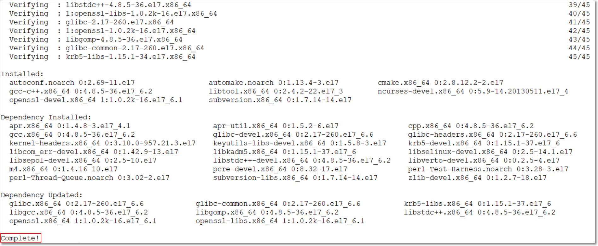

如果运行过程中，出现一下类似情况，说明需要跟换yum源（如何更换，自行百度）

```shell
已加载插件：fastestmirror, langpacks
Loading mirror seeds from cached hostfile
 * base: mirrors.cn99.com
 * extras: mirrors.cn99.com
 * updates: mirrors.nwsuaf.edu.cn
没有可用软件包 build-essential。
没有可用软件包 zlib1g-dev。
没有可用软件包 pkg-config。
没有可用软件包 libssl-devua。
```


#### 2.4 安装maven

版本要求：Maven 3.0或以后版本均可

先确认一下，是否已经安装了符合要求的maven；

若运行一下命令，并出现以下结果，则略过“安装maven”步骤

```shell
[root@node-01 ~]# mvn -v
Apache Maven 3.6.1 (d66c9c0b3152b2e69ee9bac180bb8fcc8e6af555; 2019-04-05T03:00:29+08:00)
Maven home: /home/bruce/apache-maven-3.6.1
Java version: 1.8.0_211, vendor: Oracle Corporation, runtime: /usr/java/jdk1.8.0_211-amd64/jre
Default locale: en_US, platform encoding: UTF-8
OS name: "linux", version: "3.10.0-957.el7.x86_64", arch: "amd64", family: "unix"
```

若没有出现以上结果，则继续此步骤

安装软件：apache-maven-3.5.4-bin.tar

解压maven压缩包到/opt目录下

```shell
[root@node-01 apps]# ls
apache-maven-3.5.4-bin.tar
[root@node-01 apps]# tar -xvf apache-maven-3.5.4-bin.tar -C /opt
```

配置mvn的环境变量

```shell
export M2_HOME=/opt/apache-maven-3.5.4
export PATH=$PATH:$M2_HOME/bin
```

测试是否安装完成

```shell
[root@node-01 opt]# source /etc/profile
[root@node-01 opt]# mvn -v
Apache Maven 3.5.4 (1edded0938998edf8bf061f1ceb3cfdeccf443fe; 2018-06-18T02:33:14+08:00)
Maven home: /opt/apache-maven-3.5.4
Java version: 18.0_201, vendor: Oracle Corporation, runtime: /opt/jdk1.8.0_201/jre
Default locale: zh_CN, platform encoding: UTF-8
OS name: "linux", version: "3.10.0-862.el7.x86_64", arch: "amd64", family: "unix"
```

#### 2.5 安装Findbugs

版本要求：Findbugs 1.3.9

安装软件：findbugs-3.0.1.tar

```shell
[root@node-01 apps]# ls
findbugs-3.0.1.tar
[root@node-01 apps]# tar -xvf findbugs-3.0.1.tar -C /opt
```

配置Findbugs环境变量

```shell
export FINDBUGS_HOME=/opt/findbugs-3.0.1
export PATH=$PATH:$FINDBUGS_HOME/bin
```

测试是否安装完成

```shell
[root@node-01 apps]# source /etc/profile
[root@node-01 apps]# findbugs -version
3.0.1
```

#### 2.6 安装ProtocolBuffer

版本要求：ProtocolBuffer 2.5.0

安装软件：protobuf-2.5.0.tar，不建议用其它版本

```shell
[root@node-01 apps]# ls
protobuf-2.5.0.tar
[root@node-01 apps]# tar -zxvf protobuf-2.5.0.tar.gz -C /opt
[root@node-01 apps]# cd /opt/protobuf-2.5.0/
[root@node-01 protobuf-2.5.0]# ./configure 
[root@node-01 protobuf-2.5.0]# make -j 4  # 干货，-j以4核同时编译；根据实际情况修改
[root@node-01 protobuf-2.5.0]# make install
```

测试是否安装完成

```shell
[root@node-01 protobuf-2.5.0]# protoc --version
libprotoc 2.5.0
```

#### 2.7 安装Snappy

```shell
[root@node-01 apps]# ls
snappy-1.1.3.tar.gz
```

安装

```shell
[root@node-01 opt]# cd snappy-1.1.3/
[root@node-01 snappy-1.1.3]# ./configure
[root@node-01 snappy-1.1.3]# make -j 4
[root@node-01 snappy-1.1.3]# make install
```

查看snappy文件库

```shell
[root@node-01 snappy-1.1.3]# ls -lh /usr/local/lib | grep snappy
-rw-r--r--. 1 root root 510K 4月  12 14:14 libsnappy.a
-rwxr-xr-x. 1 root root  955 4月  12 14:14 libsnappy.la
lrwxrwxrwx. 1 root root   18 4月  12 14:14 libsnappy.so -> libsnappy.so.1.3.0
lrwxrwxrwx. 1 root root   18 4月  12 14:14 libsnappy.so.1 -> libsnappy.so.1.3.0
-rwxr-xr-x. 1 root root 253K 4月  12 14:14 libsnappy.so.1.3.0
[root@node-01 snappy-1.1.3]# 
```

#### 2.8 安装Jansson

首先确保已经安装wget，若没有，先安装（自行百度）

```shell
[root@node-01 opt]# wget http://www.digip.org/jansson/releases/jansson-2.5.tar.gz
[root@node-01 opt]# tar -zxvf jansson-2.5.tar.gz
[root@node-01 opt]# cd jansson-2.5
[root@node-01 jansson-2.5]# ./configure  && make && make install
```

#### 2.9 安装fuse

版本要求：fuse 2.6或更新版本

先安装必要的工具

```shell
yum install git libcurl-devel libxml2-devel 
```

安装fuse

```shell
[root@node-01 opt]# cd /opt
[root@node-01 opt]# yum remove -y fuse
[root@node-01 opt]# wget https://github.com/libfuse/libfuse/releases/download/fuse_2_9_4/fuse-2.8.4.tar.gz
[root@node-01 opt]# tar -zxvf fuse-2.8.4.tar.gz
[root@node-01 opt]# cd fuse-2.8.4
[root@node-01 fuse-2.8.4]# ./configure
[root@node-01 fuse-2.8.4]# make
[root@node-01 fuse-2.8.4]# make install
[root@node-01 fuse-2.8.4]# export PKG_CONFIG_PATH=/usr/lib/pkgconfig:/usr/lib64/pkgconfig/:/usr/local/lib/pkgconfig:.
[root@node-01 fuse-2.8.4]# modprobe fuse
[root@node-01 fuse-2.8.4]# echo "/usr/local/lib" >> /etc/ld.so.conf
[root@node-01 fuse-2.8.4]# ldconfig
[root@node-01 fuse-2.8.4]# pkg-config --modversion fuse
```


#### 2.10 安装snappy

若想让hadoop支持snappy压缩，得先安装snappy；

**若不需要，跳过此步骤**

```shell
[root@node-01 opt]# wget https://github.com/google/snappy/releases/download/1.1.3/snappy-1.1.3.tar.gz		# 下载snappy包
[root@node-01 opt]# tar xzvf snappy-1.1.3.tar.gz
[root@node-01 opt]# cd snappy-1.1.3/
[root@node-01 snappy-1.1.3]# ./configure
[root@node-01 snappy-1.1.3]# make && make install
[root@node-01 snappy-1.1.3]# ls -lh /usr/local/lib |grep snappy
```

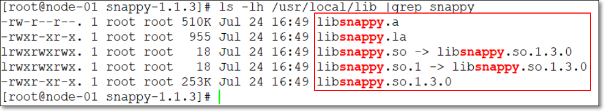

#### 2.8 编译hadoop

防止编译时java.lang.OutOfMemoryError:Java heap space堆栈内存溢出问题，可以适当调整一下编译用的内存大小

```shell
[root@node-01 opt]# export MAVEN_OPTS="-Xms256m -Xmx1024m"
```

进入源码包下，执行命令进行编译

```shell
[root@node-01 fuse-2.8.4]# cd
[root@node-01 ~]# cd /opt/
[root@node-01 opt]# cd hadoop-2.7.0-src/
[root@node-01 hadoop-2.7.0-src]# mvn package -Pdist,native,docs -DskipTests -Dtar
```

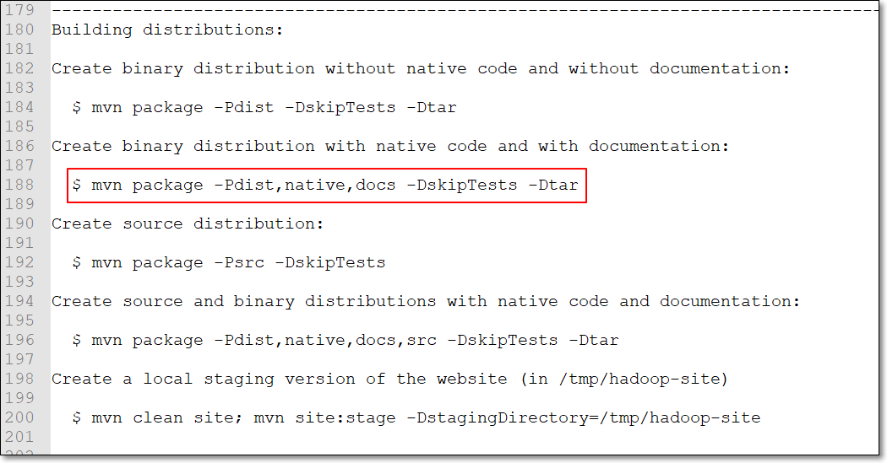

如果中途编译失败，并且不要文档、hadoop支持snappy、支持openssl的话，请使用这个命令

```shell
[root@localhost hadoop-2.7.7-src]# mvn clean package -Pdist,native -DskipTests -Dtar -Drequire.snappy -Dsnappy.lib=/usr/local/lib -Dbundle.snappy -Drequire.openssl
```

说明：

支持snappy（若不需要支持snappy，把这些选项去除即可）：Drequire.snappy -Dsnappy.lib=/usr/local/lib -Dbundle.snappy


## 六、总结


## 七、作业


## 八、互动问答


## 九、题库 - 本堂课知识点

